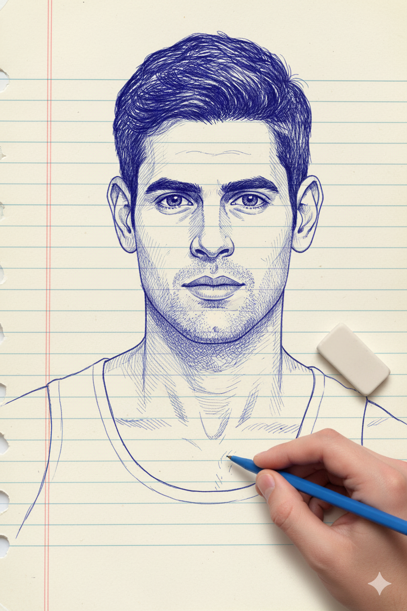
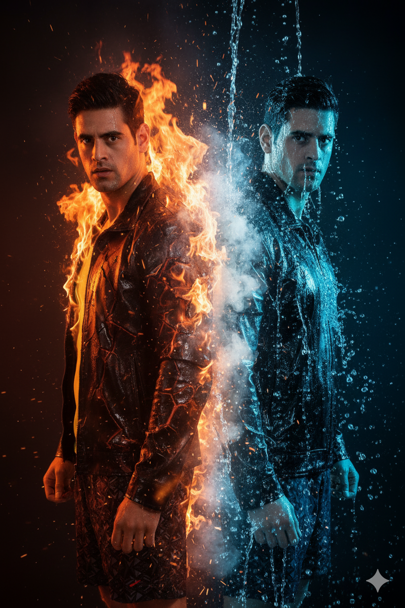
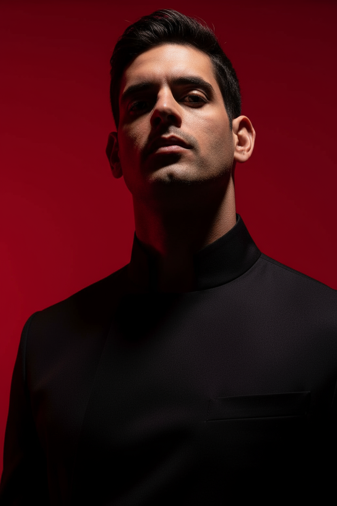
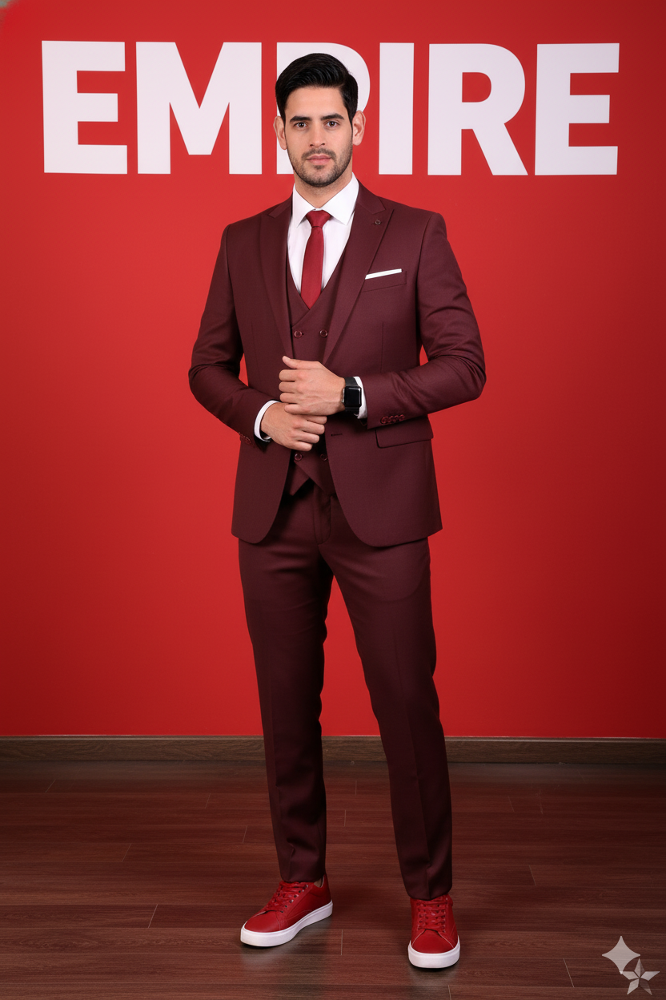
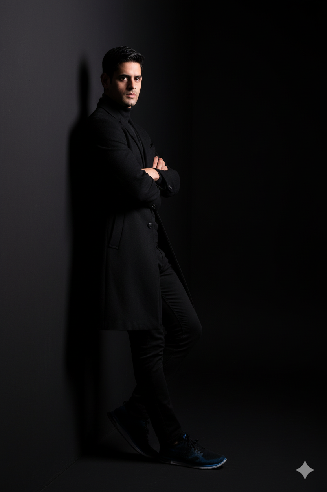
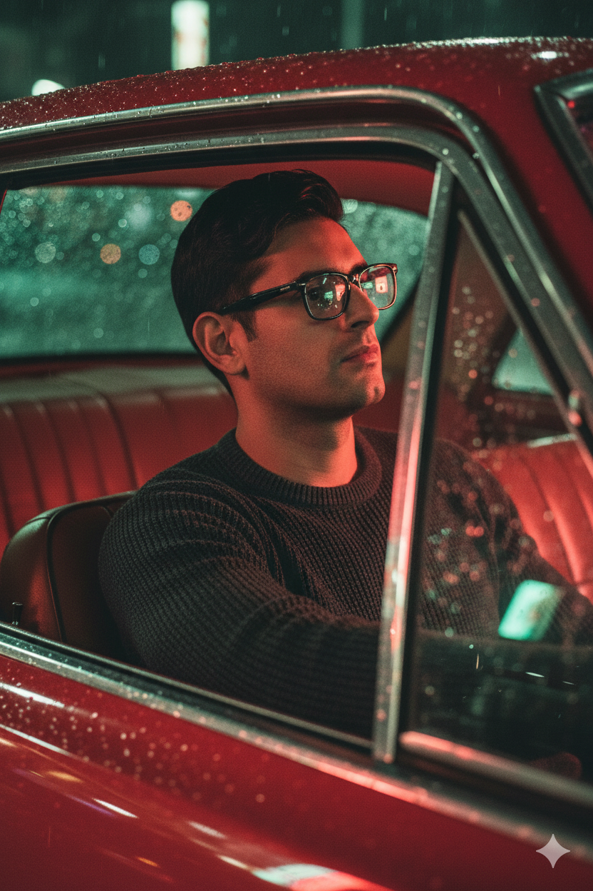
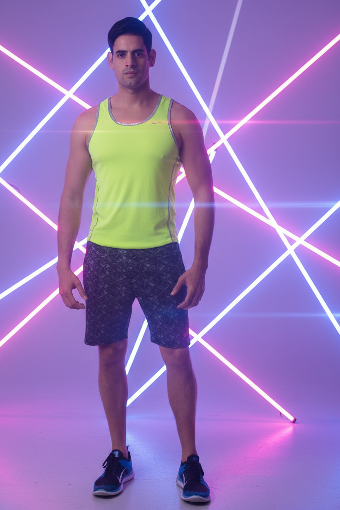

# 🎨 Photo - AI Image Prompts Collection

A curated collection of prompts to generate realistic photographs and portraits using the latest AI models like NanoBanana, GPT-5, Midjourney, DALL-E, and Stable Diffusion.

[](LICENSE)
[](CONTRIBUTING.md)
[](CONTRIBUTING.md)

## 📋 Table of Contents

- [Available Models](#available-models)
- [Featured Examples](#featured-examples)
- [How to Use](#how-to-use)
- [Contributing](#contributing)
- [Repository Structure](#repository-structure)
- [Community](#community)

## 🤖 Available Models

| Model | Folder | Prompts | Features |
|--------|---------|---------|----------|
| NanoBanana | [`/prompts/nanobanana`](./prompts/nanobanana) | 5 | Extreme photorealism |
| GPT-5 | [`/prompts/gpt-5`](./prompts/gpt-5) | 2 | Advanced contextual understanding |
| Midjourney | [`/prompts/midjourney`](./prompts/midjourney) | 0 | Conceptual art and creativity |
| DALL-E | [`/prompts/dalle`](./prompts/dalle) | 0 | Versatility and precision |
| Stable Diffusion | [`/prompts/stable-diffusion`](./prompts/stable-diffusion) | 0 | Open source and customizable |

## ⭐ Featured Examples

### Prompt Gallery

| Image | Model | Style | Prompt | Link |
|-------|-------|-------|--------|------|
| <br>*Ink Sketch Drawing* | **NanoBanana** | Artistic Line Drawing | Photo-style blue and white ink sketch on notebook paper, intricate fine line detailing, hand holding pen and eraser, work in progress aesthetic... | [View full →](./prompts/nanobanana/artistic/ink-sketch-drawing.md) |
| <br>*Fire & Water Duality* | **NanoBanana** | Epic Cinematic | Two identical figures back to back, one engulfed in flames, one drenched in water, dramatic elemental collision, perfect symmetry, 8K hyperrealism... | [View full →](./prompts/nanobanana/portrait/fire-water-duality.md) |
| <br>*Crimson Red Cinematic* | **GPT-5** | Cinematic High Contrast | Vertical portrait (1080x1920) with stark cinematic lighting, low upward angle, deep crimson red background, sculptural elegance and quiet dominance... | [View full →](./prompts/gpt-5/portrait/crimson-red-cinematic.md) |
| <br>*Empire Burgundy Suit* | **NanoBanana** | Fashion Editorial | Stylish burgundy three-piece suit with red sneakers, confident pose against red wall with "EMPIRE" text, modern high-low fashion mix... | [View full →](./prompts/nanobanana/portrait/empire-burgundy-suit.md) |
| <br>*Minimalist Studio Silhouette* | **NanoBanana** | Minimalist Studio | Minimalist studio portrait against black wall, dramatic side lighting creating mysterious silhouette, all-black outfit, reserved expression... | [View full →](./prompts/nanobanana/portrait/minimalist-studio-silhouette.md) |
| <br>*Vintage Car Night Portrait* | **NanoBanana** | Cinematic Photorealism | Cinematic hyper-realistic portrait inside vintage red car at night, neon reflections on rain-soaked windows, moody lighting, 35mm f/1.4 lens... | [View full →](./prompts/nanobanana/portrait/vintage-car-night-portrait.md) |
| <br>*Neon Lights Portrait* | **GPT-5** | Futuristic Neon | Photorealistic neon portrait with vibrant purple, pink, and blue light tubes, dramatic side lighting, chrome reflective surfaces, cyberpunk aesthetic... | [View full →](./prompts/gpt-5/portrait/neon-lights-portrait.md) |

> 💡 **Tip:** Click "View full" to access detailed prompts, parameters, and negative prompts.

## 💡 How to Use

1. **Explore** the folder for the model you're using
2. **Browse** categories (portrait, landscape, artistic, etc.)
3. **Copy** the prompt that interests you
4. **Customize** parameters according to your needs
5. **Share** your results in Issues or Discussions

### Quick Example

```


# 1. Find a prompt

cd prompts/nanobanana/portrait/

# 2. Read the .md file with all details

cat fire-water-duality.md

# 3. Copy the prompt and use it in your model

```

## 🤝 Contributing

This repository grows thanks to the community! All contributions are made via **Fork + Pull Request**.

### How to contribute:

1. **Fork** this repository (Fork button at the top right)
2. **Clone** your fork: `git clone https://github.com/YOUR-USERNAME/photo.git`
3. **Create** a branch: `git checkout -b prompt/model-category-name`
4. **Add** your prompt following the [template](./assets/template-prompt.md)
5. **Commit** your changes: `git commit -m "feat: add X prompt"`
6. **Push** to your fork: `git push origin your-branch`
7. **Open** a Pull Request

📖 Read the [Complete Contribution Guide](CONTRIBUTING.md) for more details.

### What can you contribute?

- ✨ New tested and functional prompts
- 🖼️ Visual examples of your generations
- 🐛 Reports of prompts that don't work
- 📚 Documentation improvements
- 💡 Tips and variations of existing prompts

## 📂 Repository Structure

```

prompts/
├── nanobanana/
│   ├── portrait/
│   ├── landscape/
│   └── artistic/
├── gpt-5/
├── midjourney/
├── dalle/
└── stable-diffusion/

examples/          \# Generated example images
assets/            \# Templates and resources

```

Each prompt includes:
- 📝 Complete and optimized prompt
- 🚫 Negative prompt (what to avoid)
- ⚙️ Recommended parameters
- 🖼️ Visual examples
- 💡 Usage tips and variations

## 🌟 Most Popular Prompts

*This section will be updated with the most used and best-rated prompts by the community.*

## 🎓 Learning Resources

### Guides by Model

- [NanoBanana Guide](./docs/nanobanana-guide.md) *(coming soon)*
- [Midjourney Guide](./docs/midjourney-guide.md) *(coming soon)*
- [Prompt Engineering Guide](./docs/prompt-engineering-basics.md) *(coming soon)*

### External Links

- [Prompt Engineering Guide](https://www.promptingguide.ai/)
- [Midjourney Documentation](https://docs.midjourney.com/)
- [Stable Diffusion Prompt Book](https://stability.ai/learn)

## 💬 Community

Questions? Ideas? Want to share your results?

- 💭 [Discussions](https://github.com/webmip/photo/discussions) - General conversations
- 🐛 [Issues](https://github.com/webmip/photo/issues) - Report problems
- ⭐ [Star this repo](https://github.com/webmip/photo) - Help others discover it

## 📜 License

This project is licensed under **[CC0-1.0](LICENSE)** - Public Domain Universal.

This means:
- ✅ You can use these prompts commercially
- ✅ You can modify them without restrictions
- ✅ No attribution required (though appreciated)
- ✅ You can distribute them freely

## 🙏 Acknowledgments

Thanks to all the [contributors](https://github.com/webmip/photo/graphs/contributors) who make this collection grow.

Featured community prompts:
- *Be the first to appear here!*

---

<div align="center">

**⚡ Found it useful? Give it a ⭐ and share with other creators**

[Report an Issue](https://github.com/webmip/photo/issues/new) · [Request Prompt](https://github.com/webmip/photo/issues/new?template=request-prompt.md) · [Contribute](CONTRIBUTING.md)

</div>
