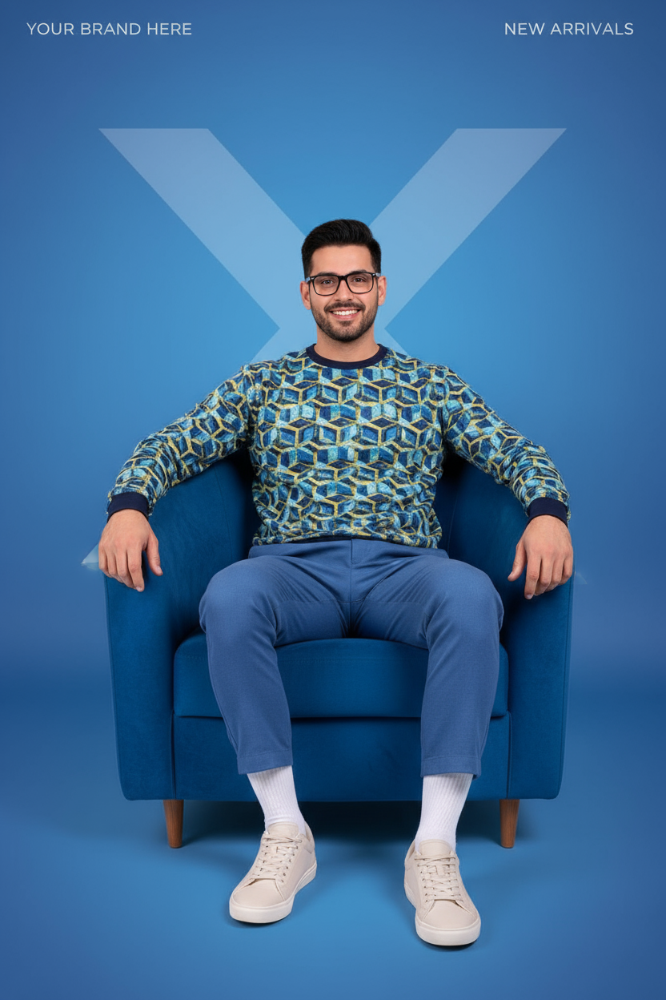

# Modern Blue Armchair Advertisement

## 📝 General Information

- **Model:** GPT-5 (via Perplexity)
- **Category:** Advertising
- **Style:** Modern Commercial / Editorial
- **Difficulty:** Intermediate
- **Reference Image:** [Pixabay Reference](https://pixabay.com/es/photos/tall-man-entrenador-joven-body-1203884/)

## 🎨 Prompt

```
A striking, modern advertisement featuring a handsome male with exact facial features 
from the reference image. 100% face match - preserve all face proportions, skin tone, 
hairstyle, and expression exactly. Maintain ultra-consistent identity and photorealistic 
rendering.

Subject: Man with short, stylish hair and glasses, looking directly at the viewer with 
friendly, confident smile. Approachable and professional demeanor.

Outfit: Contemporary, athletic-inspired outfit. Bright blue pants and matching blue and 
yellow patterned long-sleeved top. Light neutral color sneakers with white socks. Modern 
sportswear aesthetic with bold color coordination.

Pose: Sitting comfortably in a vibrant blue, plush, rounded armchair. Relaxed, confident 
posture. Natural sitting position conveying comfort and style.

Background: Clean gradient blue background creating modern, minimalist aesthetic. Large 
stylized white letter "X" subtly placed behind subject as design element. Professional 
commercial photography backdrop.

Advertisement Elements: Faint placeholder text elements in top left and top right corners, 
characteristic of magazine or product advertisement layout. Clean, editorial design with 
space for copy and branding.

Technical: Professional commercial photography, even studio lighting, sharp focus on face 
and outfit details, clean composition, editorial quality, modern advertising aesthetic.

Ultra high-resolution, photorealistic, commercial photography quality, professional styling, 
magazine-ready composition, 8K detail.
```

## 🚫 Negative Prompt

```
blurry, low quality, distorted, deformed, ugly, bad anatomy, bad proportions,
extra limbs, cloned face, disfigured, gross proportions, malformed limbs,
cartoon, anime, painting, drawing, sketch, illustration, unrealistic,
face morphing, inconsistent identity, altered facial features, wrong proportions,
cluttered background, busy composition, distracting elements, messy styling,
poor lighting, harsh shadows, overexposed, underexposed,
cheap furniture, old-fashioned design, dated aesthetic,
watermark, signature, actual text, readable text, logos
```

## ⚙️ Recommended Parameters

| Parameter | Value | Description |
|-----------|-------|-------------|
| Model | GPT-5 via Perplexity | Advanced contextual understanding |
| Quality | High/Max | Maximum quality setting |
| Style | Photorealistic | Commercial photography emphasis |
| Aspect Ratio | 3:4 or 4:5 | Vertical magazine format |
| Detail Level | High | Maximum detail rendering |

## 🖼️ Visual Examples


*Modern commercial advertisement with blue armchair and athletic-inspired outfit*
