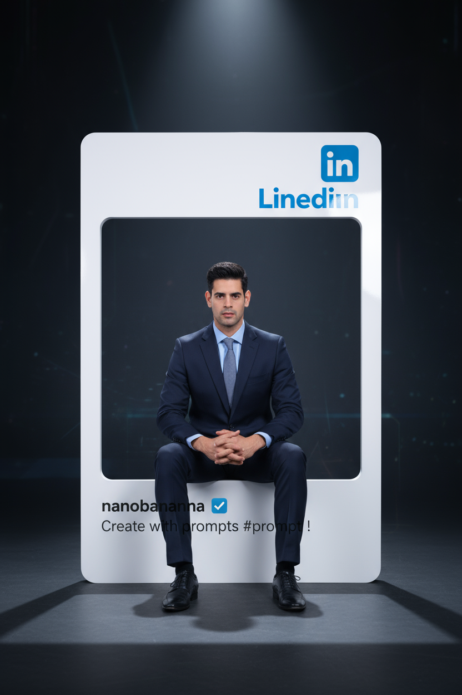

# LinkedIn Frame Portrait

## 📝 General Information

- **Model:** GPT-5 (via Perplexity)
- **Category:** Social Media
- **Style:** Professional / Social Media Frame
- **Difficulty:** Intermediate
- **Reference Image:** [Pixabay Reference](https://pixabay.com/es/photos/tall-man-entrenador-joven-body-1203884/)

## 🎨 Prompt

```
Stylish portrait of the character sitting position inside a white 3D [LinkedIn] frame 
cutout with the logo, in professional suit. Dark background, cinematic lighting, 
ultra-realistic. [LinkedIn] id : 'nanobanana' with blue checkmark. Caption should be 
"Create with prompts #prompt !
```

## 🚫 Negative Prompt

```
blurry, low quality, distorted, deformed, ugly, bad anatomy, bad proportions,
extra limbs, cloned face, disfigured, gross proportions, malformed limbs,
cartoon, anime, painting, drawing, sketch, illustration, unrealistic,
face morphing, inconsistent identity, altered facial features, wrong proportions,
cluttered background, busy composition, distracting elements,
watermark, signature, multiple people
```

## ⚙️ Recommended Parameters

| Parameter | Value | Description |
|-----------|-------|-------------|
| Model | GPT-5 via Perplexity | Advanced contextual understanding |
| Quality | High/Max | Maximum quality setting |
| Style | Photorealistic | Professional photography emphasis |
| Aspect Ratio | 1:1 | Square social media format |
| Detail Level | High | Maximum detail rendering |

## 🖼️ Visual Examples


*Professional portrait inside white 3D LinkedIn frame with logo and blue checkmark*
