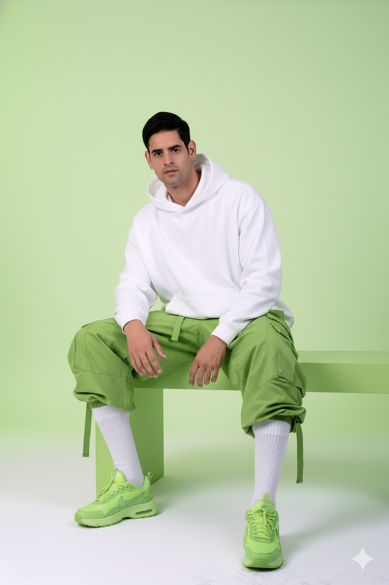

# Lime Green Editorial Fashion

## 📝 General Information

- **Model:** NanoBanana
- **Category:** Fashion
- **Style:** Editorial Fashion x Futuristic
- **Difficulty:** Intermediate
- **Reference Image:** [Pixabay Reference](https://pixabay.com/es/photos/tall-man-entrenador-joven-body-1203884/)

## 🎨 Prompt

```
modelo principal (usa mi imagen con el rostro 100% preciso), vistiendo: sudadera blanca 
oversize, pantalón tipo combat oversize verde limón, combinado con calzado: zapatillas 
Nike o neutras verde limón y calcetines blancos de canalé. Entorno: fondo de estudio en 
tono verde limón suave. Iluminación: brillo cinematográfico suave que resalta la piel y 
las texturas de la tela. Estilo: editorial de moda x futurista. Composición: modelo 
sentado elegantemente en un banco verde limón con una postura relajada.
```

## 🚫 Negative Prompt

```
blurry, low quality, distorted, deformed, ugly, bad anatomy, bad proportions,
extra limbs, cloned face, disfigured, gross proportions, malformed limbs,
cartoon, anime, painting, drawing, sketch, illustration, unrealistic,
face morphing, inconsistent identity, altered facial features, wrong proportions,
cluttered background, busy composition, distracting elements,
watermark, signature, text, logo
```

## ⚙️ Recommended Parameters

| Parameter | Value | Description |
|-----------|-------|-------------|
| Steps | 40-50 | High detail for fabric textures |
| CFG Scale | 7-9 | Balanced for natural colors |
| Sampler | DPM++ 2M Karras | Best for photorealism |
| Resolution | 768x1024 or 1024x1536 | Vertical portrait format |
| Seed | [Optional] | Use for consistency across variations |

## 🖼️ Visual Examples


*Editorial fashion portrait with lime green oversize outfit and soft studio lighting*
