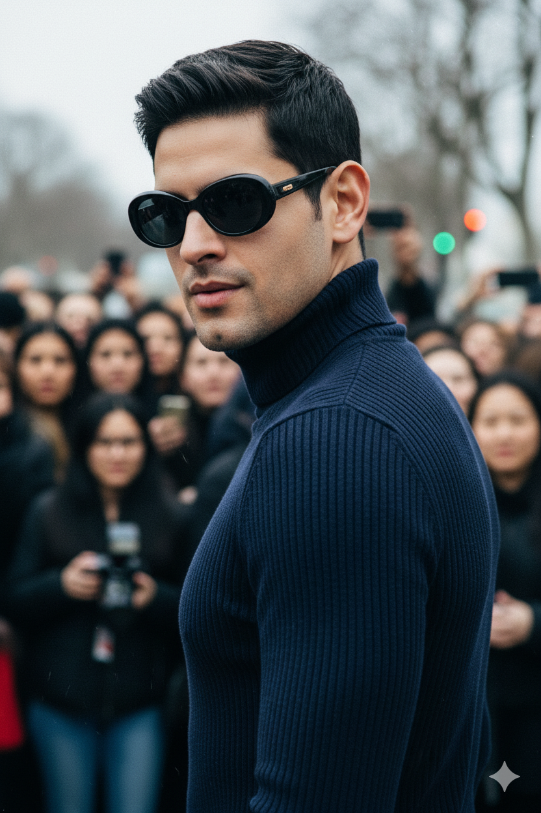

# Paparazzi Street Style Portrait

## 📝 General Information

- **Model:** NanoBanana
- **Category:** Portrait
- **Style:** Paparazzi / Street Photography
- **Difficulty:** Advanced
- **Reference Image:** [Pixabay Reference](https://pixabay.com/es/photos/tall-man-entrenador-joven-body-1203884/)

## 🎨 Prompt

```
Unplanned paparazzi style portrait capturing an intense, close-up moment of a man with 
exact facial features from reference photo. Preserve all face proportions, skin tone, 
hairstyle, and expression exactly. Ultra-consistent identity with raw, spontaneous energy.

Expression and Pose: Man looking over his shoulder with confident smirk. Intense, striking 
features. Caught in a candid moment, aware of camera but unfazed. Effortless confidence 
and street style charisma.

Camera Angle: Shot from slightly low angle, showing only face and shoulders. Close-up 
framing creating intimate, confrontational energy. Paparazzi perspective capturing the moment.

Outfit: Dark turtleneck and stylish sunglasses. Effortless street style chic. Fashion-forward 
yet understated. Contemporary urban sophistication.

Background: Blurred, bustling crowd creating depth and context. Busy street environment 
with people out of focus. Paris Fashion Week chaos atmosphere. Urban energy and movement.

Lighting: Harsh camera flash creating raw, spontaneous look. High-ISO texture with visible 
grain. Direct flash illumination typical of paparazzi photography. Authentic street photography 
lighting with strong highlights and shadows.

Technical: Raw and spontaneous aesthetic. High-ISO grain texture. Flash photography look. 
Candid street photography style. Photojournalistic quality with fashion edge. Sharp focus 
on subject, motion blur in background.

Ultra high-resolution 8K, hyperdetailed facial features, photorealistic paparazzi aesthetic, 
authentic street photography grain, professional candid photography, extreme detail with 
raw spontaneous energy.
```

## 🚫 Negative Prompt

```
blurry face, low quality, distorted, deformed, ugly, bad anatomy, bad proportions,
extra limbs, cloned face, disfigured, gross proportions, malformed limbs,
cartoon, anime, painting, drawing, sketch, illustration, 3d render,
face morphing, inconsistent identity, altered facial features, wrong proportions,
studio lighting, soft lighting, professional setup, posed portrait,
clean background, empty street, no crowd, static composition,
oversaturated, artificial colors, heavy filters, overprocessed,
smiling broadly, casual expression, relaxed pose,
watermark, signature, text, logo
```

## ⚙️ Recommended Parameters

| Parameter | Value | Description |
|-----------|-------|-------------|
| Steps | 40-50 | High detail for texture and grain |
| CFG Scale | 8-10 | Strong adherence for authentic look |
| Sampler | DPM++ 2M Karras | Best for photorealism with grain |
| Resolution | 768x1024 or 1024x1536 | Vertical portrait format |
| Seed | [Optional] | Use for consistency across variations |

## 🖼️ Visual Examples


*Raw paparazzi-style portrait with harsh flash, confident smirk, and bustling crowd background*
